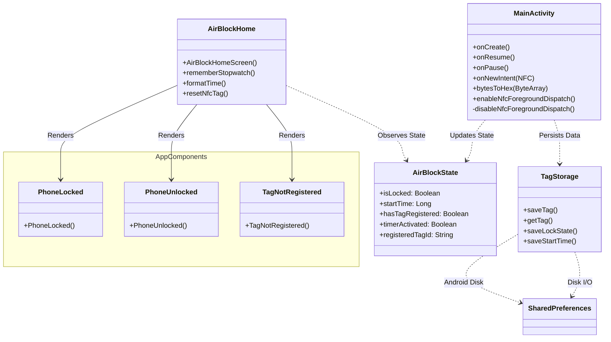

# AirBlock 🛡️

**AirBlock** is a minimalist Android application designed to improve focus and digital wellbeing. It utilizes physical **NFC Tags** as secure keys to lock and unlock the device's "Focus Mode".

Unlike traditional apps that can be easily bypassed, AirBlock requires a physical action (scanning a tag) to change states, adding a layer of friction that helps break digital addiction loops.

---

## 🚀 Features

* **NFC Authentication:** Register any standard NFC tag (NTAG215 recommended) as your physical security key.
* **Focus Chronometer:** Tracks your focus sessions. The timer persists even if the app is closed or the phone reboots.
* **Secure Persistence:** Uses SharedPreferences to securely store tag signatures and lock states.
* **Modern UI:** Built entirely with **Jetpack Compose** using Material Design 3.
* **Smart State Recovery:** The app remembers if it was locked/unlocked upon restarting.

---

## 🛠️ Tech Stack

* **Language:** Kotlin
* **UI Framework:** Jetpack Compose
* **Hardware Integration:** Android NFC Adapter API
* **Architecture:** MVVM (Model-View-ViewModel pattern)
* **Persistence:** SharedPreferences & Custom State Management

---

## 🏗️ Architecture

The app follows a unidirectional data flow architecture. The `MainActivity` acts as the hardware bridge, while `AirBlockState` manages the reactive UI state.



---

## 📱 Screenshots

*(Screenshots coming soon...)*

---

## 💻 How to Run

1.  **Clone the repository:**
    ```bash
    git clone [https://github.com/Tomiboard/AirBlock.git](https://github.com/Tomiboard/AirBlock.git)
    ```
2.  **Open in Android Studio:**
    * Use Android Studio Ladybug (or newer).
    * Wait for Gradle to sync.
3.  **Connect a Physical Device:**
    * **Important:** You need a real Android phone with NFC support. The Android Emulator **cannot** simulate NFC tag scanning for this app.
4.  **Build & Run:**
    * Press `Shift + F10` or the "Run" button.

---

## 🛠️ Usage Guide

1.  **Initial Setup:** Upon first launch, the app is in "Learning Mode".
2.  **Register Key:** Tap your NFC Tag against the back of the phone. The app will save its unique signature.
3.  **Focus Mode:** Tap the registered tag again to **LOCK** the phone. The chronometer will start counting your focus time.
4.  **Unlock:** Tap the tag again to finish the session.

---

## 🔮 Roadmap

* [x] NFC Tag Registration & Persistence
* [x] Focus Chronometer (background persistence)
* [x] State Recovery after reboot
* [ ] **App Blocking:** Block distracting apps (Instagram, TikTok) while locked using `UsageStats`.
* [ ] Statistics Dashboard.

---

## 📄 License

This project is open source and available under the [MIT License](LICENSE).

---

### 👨‍💻 Author

Developed with ❤️ by **Thomas Mugica**.

